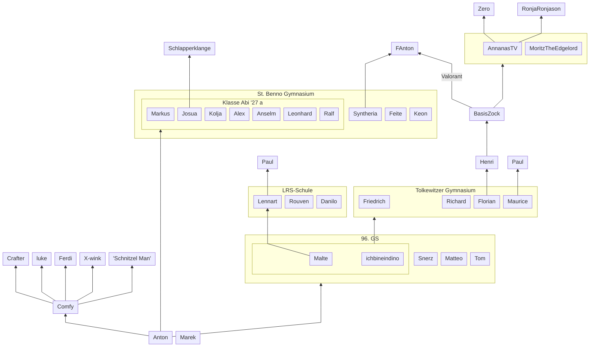

```mermaid
---
config:
    flowchart:
        curve: linear
        nodeSpacing: 10
        rankSpacing: 50
        padding: 6
---
flowchart BT

Annhilati[Anton]

Marek

%% BEGINN Kontext St. Benno Gymnasium

Annhilati --> kl27a

subgraph StBennoGymnasium [St. Benno Gymnasium]
    subgraph kl27a [Klasse Abi '27 a]
        laemmicore[Markus]
        joshi[Josua]
        Pringelchen[Kolja]
        brokkoli[Alex]
        nocki[Anselm]
        laserlink[Leonhard]
        ralfopro[Ralf]
    end
    Syntheria
    Feite
    PearlyPinky[Keon]
end
Syntheria --> FAnton

joshi --> Schlapperklange

%% ENDE Kontext St. Benno Gymnasium
%% BEGINN Kontext 96. GS

Annhilati[Anton] ---> 96Grundschule

subgraph 96Grundschule [96. GS]
    subgraph 96GSxTolkewitz [ ]
        Malte
        Fionn[ichbineindino]
    end
    Tony[Snerz]
    Matteo
    Tom
end

%% ENDE Kontext 96. GS
%% BEGINN Kontext Tolkewitz

Malte --> lurzz
lurzz --> dopesince[Paul]
96GSxTolkewitz --> TolkewitzerGymnasium

subgraph TolkewitzerGymnasium [Tolkewitzer Gymnasium]
    RandomDude[Friedrich]
    GermanDaddy[Richard]
    Florian
    Creepnox[Maurice]
end
Creepnox --> speakbleyt[Paul]
Florian --> Henri

%% ENDE Kontext Tolkewitz

subgraph LRSSchule [LRS-Schule]
    lurzz[Lennart]
    gardine[Rouven]
    Danilo[Danilo]
end

Henri --> BasisZock
BasisZock --> BasisZockViewer
BasisZock -- Valorant --> FAnton
subgraph BasisZockViewer [ ]
    AnnanasTV
    MoritzTheEdgelord
end

AnnanasTV --> Zero
AnnanasTV --> RonjaRonjason

%% BEGINN Kontext Comfy

Annhilati --> Comfy
Comfy --> Crafter
Comfy --> luke
Comfy --> Ferdi
Comfy --> Xwink[X-wink]
Comfy --> Arabroke['Schnitzel Man']

%% ENDE Kontext Comfy
```