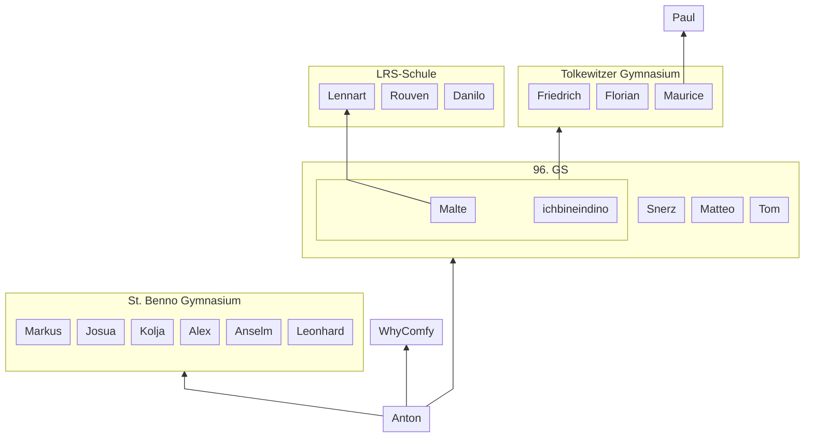

```mermaid
---
config:
    flowchart:
        curve: linear
        nodeSpacing: 10
        rankSpacing: 50
        padding: 6
---
flowchart BT

Annhilati[Anton] ---> 96gs
Annhilati --> WhyComfy
Annhilati --> benno

subgraph benno [St. Benno Gymnasium]
    laemmicore[Markus]
    joshi[Josua]
    Pringelchen[Kolja]
    brokkoli[Alex]
    nocki[Anselm]
    laserlink[Leonhard]
end

subgraph 96gs [96. GS]
    subgraph 96twgym [ ]
        Malte
        Fionn[ichbineindino]
    end
    Tony[Snerz]
    Matteo
    Tom
end

Malte --> lurzz
96twgym --> twgym

subgraph twgym [Tolkewitzer Gymnasium]
    Friedrich
    Florian
    Creepnox[Maurice]
end
Creepnox --> speakbleyt[Paul]

subgraph lrs [LRS-Schule]
    lurzz[Lennart]
    gardine[Rouven]
    Danilo[Danilo]
end

```